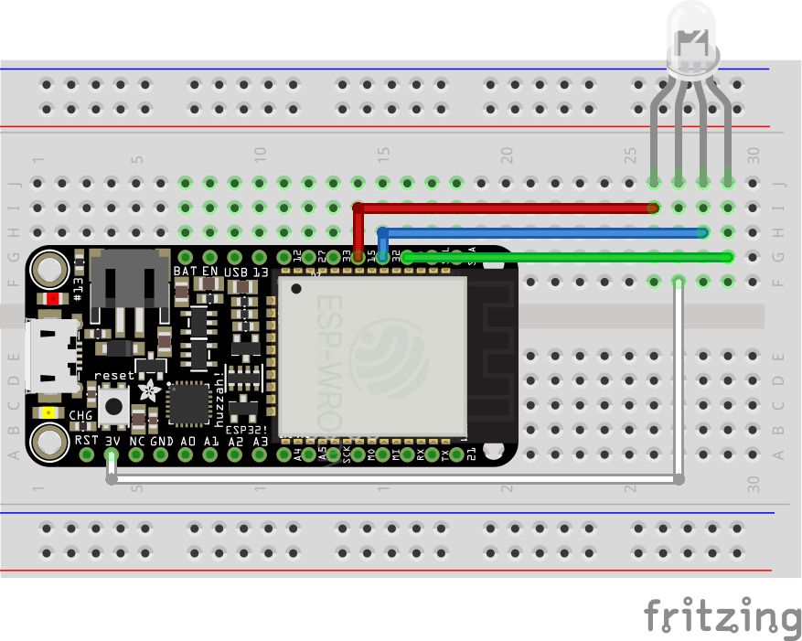
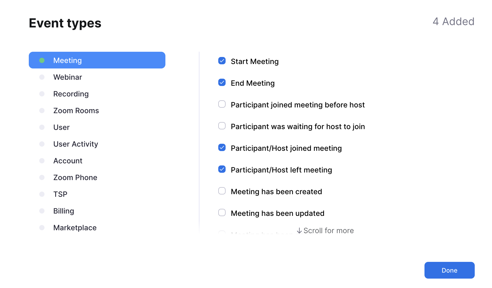
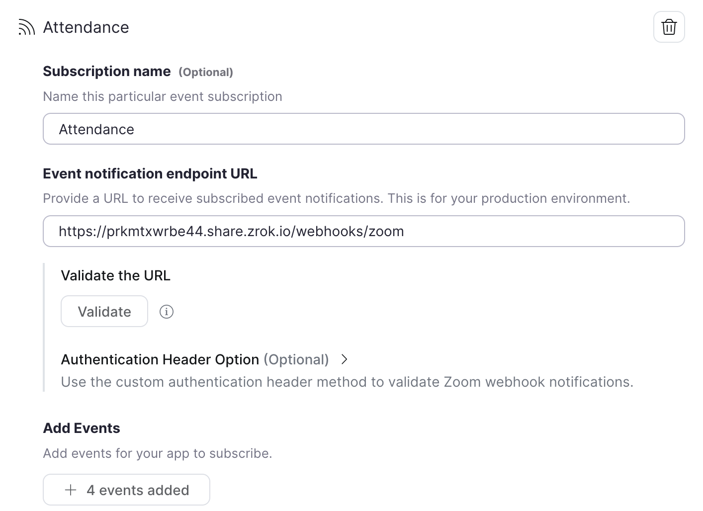

# viam-on-air

An on-air notfifier when currently occupied by a meeting or video call

Built with:
- [Viam](https://viam.com)
- [Starlette](https://www.starlette.io/)
- [Zoom](https://zoom.us)

-----

**Table of Contents**

- [Setup](#setup)
- [Development](#development)
- [License](#license)

## Setup

### Wiring 

While this app will work with [any board supported by Viam](https://docs.viam.com/installation/#prepare-your-board), this is a good use case for the [ESP32](https://docs.viam.com/installation/prepare/microcontrollers/) supported by the [micro-RDK](https://github.com/viamrobotics/micro-rdk).

The diagram belows shows an example of wiring an ESP32 development board to an [RGB LED](https://www.adafruit.com/product/159):



_Note the GPIO pin numbers connected to the LED when configuring the board in Viam and the Python app later. _

### Viam

After [flashing the ESP32](https://docs.viam.com/installation/prepare/microcontrollers/) with the micro-RDK and confirmed it has a connection to Viam, [configure the board](https://docs.viam.com/micro-rdk/board/esp32/) and relevant pins using the following JSON (replace the entire contents in "Raw JSON" mode):

```json
{
  "components": [
    {
      "attributes": {
        "pins": [
          5,
          18,
          19
        ]
      },
      "depends_on": [],
      "name": "board",
      "model": "esp32",
      "type": "board",
      "namespace": "rdk"
    }
  ]
}
```

**Remember to replace the numbers in the list of `pins` with the ones matching the physical wiring of the project.**

Restart the ESP32 to confirm a working configuration.

### Web app

The associated Python code in this repo is a small web service that receives [webhook requests from Zoom](https://developers.zoom.us/docs/api/rest/webhook-reference/) to trigger the different color states of the LED attached to the ESP32.

To configure the app with the required API key, API key ID, and location address for the Viam machine and secret token from Zoom, make a copy of the `.env.example` file called `.env`. Get the Viam values from the "Code Sample" tab when viewing the robot details in the Viam app. 
Get the Zoom secret token by [creating a webhook-only app](https://developers.zoom.us/docs/api/rest/webhook-only-app/) in the [Zoom App Marketplace](https://marketplace.zoom.us/) and subscribing to the following events when adding an event subscription:



Update the `.env` file with the relevant values, including the configured pins from Viam as `RGB_PINS` and your Zoom username.

Install the project dependencies using `pip` while in the root of the project repository:

```console
pip install .
```

Once that is completed, start the app:

```console
python -m viam_on_air
```

This will connect to the ESP32 using the [Viam Python SDK](https://python.viam.dev/) and start a webserver on `0.0.0.0:8000` (a.k.a localhost:8000).

```console
❯ python -m viam_on_air
INFO:     Started server process [96243]
INFO:     Waiting for application startup.
2023-11-22 17:40:02,956         INFO    viam.rpc.dial (dial.py:286)     Connecting to socket: /tmp/proxy-LSL4xP2F.sock
INFO:     Application startup complete.
INFO:     Uvicorn running on http://0.0.0.0:8000 (Press CTRL+C to quit)
```

#### Activating Zoom app

To start receiving webhook events from Zoom, the webhook endpoint needs to be validated first. To do this without deploying to a live server, use a service like [ngrok](https://ngrok.com/), [zrok](https://zrok.io/), or [something else](https://github.com/anderspitman/awesome-tunneling?tab=readme-ov-file) to provide a secure proxy to the local server.

```console
brew install zrok
zrok share public localhost:8000
```

The endpoint URL configured for the webhook should end in `/webhooks/zoom`, then click the "Validate" button to confirm the app is working as expected:



Once the Zoom webhook-only app has been successfully activated, you can start joining some meetings and see the on-air light in action!

Red = A meeting has started
Green = You have joined the meeting
Purple = You left the meeting
Blinking Red for 5 seconds = The meeting has just ended

## Development

Run through the same instructions as the [setup](#setup) above, except for the `pip install` and Zoom app.

Install project dependencies in development mode:

```console
pip install -e .
```

No need for a Zoom webhook-only app; use [Hoppscotch](https://hoppscotch.io/) to send stubbed webhook events to the local app. 
[Import the collection](https://docs.hoppscotch.io/documentation/features/collections#importing-collections) JSON found in the `tests/` directory to start sending events.


## License

`viam-on-air` is distributed under the terms of the [Apache-2.0](https://spdx.org/licenses/Apache-2.0.html) license.
